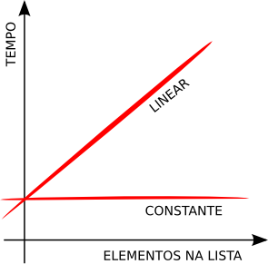

# Estrutura Dados (unifavip)
Repositório de aulas da disciplina de Estrutura de Dados - UNIFAVIP (**2016.1**)

A tabela abaixo mostra os conteúdos trabalhados em cada projeto disponível aqui no **github**. Pose-se baixar e acompanhar. 



- [Consumo **linear** vs **constante**](#Extras)


## Conteúdo das Aulas

| Aulas  | Conteúdo |
| ------------- | ------------- |
| Aula 01  | O projeto demonstra duas operações (criação e processamento) em uma grande quantidade de dados, representada pela classe **Pessoa**, analisando o tempo que se consome nessas operações. Foi utilizado as 3 bibliotecas dinâmicas de Java Collections (**Vector**, **ArrayList** e **LinkedList**). Foi demonstrado uma forma de medir o tempo através **System.currentTimeMillis()**, analisando as diferenças de tempo (consumo de processamento) variando essas estruturas e também a posição onde o dado é armazenado - no fim ou no início da estrutura. Como curiosidade foi solicitado entender as diferenças técnicas de cada classe de Collections de Java mencionados acima e porque há diferenças na performance ao usá-las para muitos dados.  |
| Aula 02  | Definido uma interface **IListaAlunos**, representando o conjunto de operações que nossa lista deverá ter. Foi implementado uma classe chamada **Vetor** que implementa a interface *IListaAlunos* e representa uma estrutura de dados **estática** para conter as operações essenciais (descritas na interface). Utilizamos um **array** de Java para armazenar os dados e foi implementado cada operação conforme nossas referências [1](#Extras), veja o [capítulo 4](https://www.caelum.com.br/apostila-java-estrutura-dados/vetores/). Foi definido outra entidade para representar os dados (classe **Aluno**), usada para implementar os métodos da classe **Vetor**. Após implementar cada operação foi sugerido e implementado o uso da biblioteca **JUnit**, aplicado pela IDE do [NetBeans](https://netbeans.org/). Criamos a classe **VetorTest** com os métodos unitários para realizar os diferentes testes de carga.|
| Aula 03  | O foco principal deste projeto é demonstrar como tornar a classe **Vetor** para permitir armazenar dados dinâmicos (quando o tamanho total dos dados será indefinido), bem como, otimizar alguns métodos para melhorar a eficiência do processamento. Foi dado ênfase para o aluno assimilar a relação de **tempo linear vs constante** e suas variações nas **Listas Sequenciais**. |


## Acompanhmento das aulas

- Utilizamos o [ClassDojo.com](https://www.classdojo.com/pt-br/) para dar feedback ao alunos.


## Alguns códigos relevantes

Bloco de código usado para testar e medir o tempo usado para cada operação desejada. Usado dentro da classe de teste unitário - **VetorTest.java**

```java
...
   @Test
    public void testAdicionarVariosAlunosEmPosicaoFIM() {
        // TOTAL como constante (ver acima)
        
        String texto = "Adicionando "+TOTAL+" Alunos no FINAL";
        long tempoInicial = System.currentTimeMillis();
        Vetor nossoVetor = new Vetor();
        
        for (int i = 0; i < TOTAL; i++) {
            Aluno aluno = new Aluno("Aluno "+(i+1));
            nossoVetor.adicionaAluno(nossoVetor.tamanho(),aluno);
        }
        
        long tempoFinal = System.currentTimeMillis();
       
        
        imprimirTempo(texto, (tempoFinal-tempoInicial));
        
        int totalAtual = nossoVetor.tamanho();
        
        assertTrue(TOTAL == totalAtual);
      
        
    }
...
    private void imprimirTempo(String texto, long tempo) {
        
       float diferenca = (float) (tempo / 1000) % 60;
       System.out.println(texto+" -> tempo: "+diferenca+ " segundos");        
    }
```


#Extras

- [1] - Apostila de Estrutura de Dados, CAELUM, [CS-14](https://www.caelum.com.br/apostila-java-estrutura-dados/)